# SƠ ĐỒ USE CASE - DIỄN ĐÀN TIN HỌC

## Mô tả hệ thống
Hệ thống diễn đàn tin học cho phép người dùng chia sẻ bài viết, tài liệu, bình luận và tương tác với nhau.

---

## BIỂU ĐỒ USE CASE (PlantUML)

```plantuml
@startuml Use Case Diagram - Dien Dan Tin Hoc

left to right direction
skinparam packageStyle rectangle
skinparam actorStyle awesome

' === ACTORS ===
actor "Người dùng khách\n(Guest)" as Guest #LightBlue
actor "Người dùng\nđã đăng nhập\n(User)" as User #LightGreen
actor "Quản trị viên\n(Admin)" as Admin #Orange

' Kế thừa
User -|> Guest
Admin -|> User

' === SYSTEM BOUNDARY ===
rectangle "Hệ thống Diễn Đàn Tin Học" {

  ' --- NHÓM XÁC THỰC ---
  package "Xác thực" {
    usecase "Đăng ký tài khoản" as UC_Register
    usecase "Đăng nhập" as UC_Login
    usecase "Quên mật khẩu\n(OTP qua email)" as UC_ForgotPwd
    usecase "Đăng xuất" as UC_Logout
  }

  ' --- NHÓM BÀI VIẾT ---
  package "Quản lý Bài viết" {
    usecase "Xem danh sách bài viết" as UC_ViewPosts
    usecase "Xem chi tiết bài viết" as UC_ViewPostDetail
    usecase "Tìm kiếm bài viết" as UC_SearchPosts
    usecase "Lọc bài viết theo\ndanh mục/tag" as UC_FilterPosts
    usecase "Tạo bài viết mới" as UC_CreatePost
    usecase "Chỉnh sửa bài viết" as UC_EditPost
    usecase "Xóa bài viết" as UC_DeletePost
    usecase "Thêm tags cho bài viết" as UC_AddTags
  }

  ' --- NHÓM TÀI LIỆU ---
  package "Quản lý Tài liệu" {
    usecase "Xem danh sách tài liệu" as UC_ViewDocs
    usecase "Xem chi tiết tài liệu" as UC_ViewDocDetail
    usecase "Tải xuống tài liệu" as UC_DownloadDoc
    usecase "Upload tài liệu" as UC_UploadDoc
    usecase "Xóa tài liệu" as UC_DeleteDoc
  }

  ' --- NHÓM BÌNH LUẬN ---
  package "Bình luận" {
    usecase "Xem bình luận" as UC_ViewComments
    usecase "Viết bình luận" as UC_CreateComment
    usecase "Trả lời bình luận" as UC_ReplyComment
    usecase "Sửa bình luận" as UC_EditComment
    usecase "Xóa bình luận" as UC_DeleteComment
  }

  ' --- NHÓM TƯƠNG TÁC ---
  package "Tương tác xã hội" {
    usecase "Theo dõi người dùng" as UC_Follow
    usecase "Bỏ theo dõi" as UC_Unfollow
    usecase "Xem danh sách\nngười theo dõi" as UC_ViewFollowers
    usecase "Lưu bài viết\n(Bookmark)" as UC_Bookmark
    usecase "Xem bài viết đã lưu" as UC_ViewBookmarks
  }

  ' --- NHÓM HỒ SƠ ---
  package "Hồ sơ cá nhân" {
    usecase "Xem hồ sơ người dùng" as UC_ViewProfile
    usecase "Cập nhật thông tin\ncá nhân" as UC_UpdateProfile
    usecase "Đổi mật khẩu" as UC_ChangePwd
    usecase "Upload avatar" as UC_UploadAvatar
    usecase "Tùy chỉnh giao diện\n(Theme)" as UC_CustomTheme
  }

  ' --- NHÓM BÁO CÁO ---
  package "Báo cáo vi phạm" {
    usecase "Báo cáo người dùng" as UC_ReportUser
    usecase "Báo cáo bài viết" as UC_ReportPost
    usecase "Báo cáo tài liệu" as UC_ReportDoc
    usecase "Xem báo cáo của tôi" as UC_ViewMyReports
  }

  ' --- NHÓM THÔNG BÁO ---
  package "Thông báo" {
    usecase "Xem thông báo" as UC_ViewNotifications
    usecase "Nhận thông báo\nbài viết mới" as UC_NotifyNewPost
    usecase "Nhận thông báo\nbình luận" as UC_NotifyComment
  }

  ' --- NHÓM LIÊN HỆ ---
  package "Liên hệ & Hỗ trợ" {
    usecase "Xem nội quy" as UC_ViewRules
    usecase "Gửi liên hệ" as UC_Contact
  }

  ' --- NHÓM QUẢN TRỊ ---
  package "Quản trị hệ thống" #LightYellow {
    usecase "Xem Dashboard\nthống kê" as UC_Dashboard
    usecase "Quản lý người dùng" as UC_ManageUsers
    usecase "Khóa/Mở khóa\ntài khoản" as UC_ToggleUser
    usecase "Cấm người dùng\n(theo loại)" as UC_BanUser
    usecase "Gỡ cấm người dùng" as UC_UnbanUser
    usecase "Quản lý bài viết" as UC_ManagePosts
    usecase "Ghim/Bỏ ghim bài viết" as UC_PinPost
    usecase "Xóa bài viết\n(với lý do)" as UC_AdminDeletePost
    usecase "Quản lý tài liệu" as UC_ManageDocs
    usecase "Xóa tài liệu\n(với lý do)" as UC_AdminDeleteDoc
    usecase "Quản lý bình luận" as UC_ManageComments
    usecase "Xóa bình luận\n(với lý do)" as UC_AdminDeleteComment
    usecase "Quản lý danh mục" as UC_ManageCategories
    usecase "Tạo danh mục" as UC_CreateCategory
    usecase "Sửa danh mục" as UC_EditCategory
    usecase "Xóa danh mục" as UC_DeleteCategory
    usecase "Xử lý báo cáo" as UC_HandleReports
    usecase "Đánh dấu báo cáo sai" as UC_MarkFalseReport
  }

}

' === QUAN HỆ GUEST ===
Guest --> UC_Register
Guest --> UC_Login
Guest --> UC_ForgotPwd
Guest --> UC_ViewPosts
Guest --> UC_ViewPostDetail
Guest --> UC_SearchPosts
Guest --> UC_FilterPosts
Guest --> UC_ViewDocs
Guest --> UC_ViewDocDetail
Guest --> UC_DownloadDoc
Guest --> UC_ViewComments
Guest --> UC_ViewProfile
Guest --> UC_ViewRules
Guest --> UC_Contact

' === QUAN HỆ USER ===
User --> UC_Logout
User --> UC_CreatePost
User --> UC_EditPost
User --> UC_DeletePost
User --> UC_AddTags
User --> UC_UploadDoc
User --> UC_DeleteDoc
User --> UC_CreateComment
User --> UC_ReplyComment
User --> UC_EditComment
User --> UC_DeleteComment
User --> UC_Follow
User --> UC_Unfollow
User --> UC_ViewFollowers
User --> UC_Bookmark
User --> UC_ViewBookmarks
User --> UC_UpdateProfile
User --> UC_ChangePwd
User --> UC_UploadAvatar
User --> UC_CustomTheme
User --> UC_ReportUser
User --> UC_ReportPost
User --> UC_ReportDoc
User --> UC_ViewMyReports
User --> UC_ViewNotifications
User --> UC_NotifyNewPost
User --> UC_NotifyComment

' === QUAN HỆ ADMIN ===
Admin --> UC_Dashboard
Admin --> UC_ManageUsers
Admin --> UC_ToggleUser
Admin --> UC_BanUser
Admin --> UC_UnbanUser
Admin --> UC_ManagePosts
Admin --> UC_PinPost
Admin --> UC_AdminDeletePost
Admin --> UC_ManageDocs
Admin --> UC_AdminDeleteDoc
Admin --> UC_ManageComments
Admin --> UC_AdminDeleteComment
Admin --> UC_ManageCategories
Admin --> UC_CreateCategory
Admin --> UC_EditCategory
Admin --> UC_DeleteCategory
Admin --> UC_HandleReports
Admin --> UC_MarkFalseReport

@enduml
```

---

## BẢNG MÔ TẢ CHI TIẾT USE CASE

### 1. NGƯỜI DÙNG KHÁCH (Guest)

| STT | Use Case | Mô tả |
|-----|----------|-------|
| 1 | Đăng ký tài khoản | Tạo tài khoản mới với username, email, password, họ tên |
| 2 | Đăng nhập | Đăng nhập bằng username/email và password |
| 3 | Quên mật khẩu | Khôi phục mật khẩu qua OTP gửi email |
| 4 | Xem danh sách bài viết | Xem tất cả bài viết đã được duyệt |
| 5 | Xem chi tiết bài viết | Xem nội dung đầy đủ của bài viết |
| 6 | Tìm kiếm bài viết | Tìm kiếm theo tiêu đề, nội dung, tác giả |
| 7 | Lọc bài viết | Lọc theo danh mục, tag, sắp xếp theo thời gian/lượt xem |
| 8 | Xem danh sách tài liệu | Xem tất cả tài liệu đã được duyệt |
| 9 | Xem chi tiết tài liệu | Xem thông tin chi tiết tài liệu |
| 10 | Tải xuống tài liệu | Download file tài liệu |
| 11 | Xem bình luận | Xem các bình luận của bài viết |
| 12 | Xem hồ sơ người dùng | Xem thông tin công khai của người dùng |
| 13 | Xem nội quy | Xem quy định của diễn đàn |
| 14 | Gửi liên hệ | Gửi email liên hệ đến admin |

### 2. NGƯỜI DÙNG ĐÃ ĐĂNG NHẬP (User)

| STT | Use Case | Mô tả |
|-----|----------|-------|
| 1 | Đăng xuất | Thoát khỏi tài khoản |
| 2 | Tạo bài viết mới | Đăng bài viết với tiêu đề, nội dung, danh mục, tags |
| 3 | Chỉnh sửa bài viết | Sửa bài viết của mình |
| 4 | Xóa bài viết | Xóa bài viết của mình |
| 5 | Thêm tags | Gắn tags cho bài viết (tối đa 10 tags) |
| 6 | Upload tài liệu | Tải lên tài liệu (PDF, DOC, PPT, ảnh - max 50MB) |
| 7 | Xóa tài liệu | Xóa tài liệu của mình |
| 8 | Viết bình luận | Bình luận vào bài viết |
| 9 | Trả lời bình luận | Reply bình luận của người khác |
| 10 | Sửa bình luận | Chỉnh sửa bình luận của mình |
| 11 | Xóa bình luận | Xóa bình luận của mình |
| 12 | Theo dõi người dùng | Follow người dùng khác |
| 13 | Bỏ theo dõi | Unfollow người dùng |
| 14 | Xem người theo dõi | Xem danh sách followers/following |
| 15 | Lưu bài viết | Bookmark bài viết yêu thích |
| 16 | Xem bài viết đã lưu | Xem danh sách bookmarks |
| 17 | Cập nhật thông tin | Sửa họ tên, username |
| 18 | Đổi mật khẩu | Thay đổi mật khẩu |
| 19 | Upload avatar | Tải lên ảnh đại diện |
| 20 | Tùy chỉnh giao diện | Thay đổi theme, màu sắc, ảnh nền |
| 21 | Báo cáo người dùng | Report người dùng vi phạm |
| 22 | Báo cáo bài viết | Report bài viết vi phạm |
| 23 | Báo cáo tài liệu | Report tài liệu vi phạm |
| 24 | Xem báo cáo của tôi | Xem lịch sử báo cáo đã gửi |
| 25 | Xem thông báo | Xem các thông báo hệ thống |
| 26 | Nhận thông báo bài mới | Nhận thông báo khi người theo dõi đăng bài |
| 27 | Nhận thông báo bình luận | Nhận thông báo khi có người bình luận bài của mình |

### 3. QUẢN TRỊ VIÊN (Admin)

| STT | Use Case | Mô tả |
|-----|----------|-------|
| 1 | Xem Dashboard | Xem thống kê tổng quan (users, posts, comments, documents, views) |
| 2 | Quản lý người dùng | Xem danh sách tất cả người dùng |
| 3 | Khóa/Mở khóa tài khoản | Vô hiệu hóa hoặc kích hoạt tài khoản |
| 4 | Cấm người dùng | Cấm theo loại: tài khoản, bình luận, đăng bài, đăng tài liệu, báo cáo |
| 5 | Gỡ cấm người dùng | Gỡ bỏ lệnh cấm cho người dùng |
| 6 | Quản lý bài viết | Xem tất cả bài viết trong hệ thống |
| 7 | Ghim/Bỏ ghim bài viết | Ghim bài viết lên đầu trang |
| 8 | Xóa bài viết (admin) | Xóa bài viết với lý do, gửi thông báo cho tác giả |
| 9 | Quản lý tài liệu | Xem tất cả tài liệu trong hệ thống |
| 10 | Xóa tài liệu (admin) | Xóa tài liệu với lý do, gửi thông báo cho tác giả |
| 11 | Quản lý bình luận | Xem tất cả bình luận |
| 12 | Xóa bình luận (admin) | Xóa bình luận với lý do, gửi thông báo |
| 13 | Quản lý danh mục | Xem danh sách danh mục |
| 14 | Tạo danh mục | Thêm danh mục mới với tên, mô tả, màu sắc |
| 15 | Sửa danh mục | Chỉnh sửa thông tin danh mục |
| 16 | Xóa danh mục | Xóa danh mục (nếu không có bài viết/tài liệu) |
| 17 | Xử lý báo cáo | Xem và xử lý các báo cáo vi phạm |
| 18 | Đánh dấu báo cáo sai | Đánh dấu báo cáo không chính xác, cảnh báo người báo cáo |

---

## LOẠI CẤM NGƯỜI DÙNG

| Loại cấm | Mô tả | Thời hạn |
|----------|-------|----------|
| account | Cấm toàn bộ tài khoản | 1 ngày / 3 ngày / 1 tuần / 1 tháng / Vĩnh viễn |
| comment | Cấm bình luận | 1 ngày / 3 ngày / 1 tuần / 1 tháng / Vĩnh viễn |
| post | Cấm đăng bài viết | 1 ngày / 3 ngày / 1 tuần / 1 tháng / Vĩnh viễn |
| document | Cấm đăng tài liệu | 1 ngày / 3 ngày / 1 tuần / 1 tháng / Vĩnh viễn |
| report | Cấm gửi báo cáo | 1 ngày / 3 ngày / 1 tuần / 1 tháng / Vĩnh viễn |

---

## QUY TẮC BÁO CÁO SAI

- 3 báo cáo sai trong 1 tháng → Cấm báo cáo 30 ngày
- 5 báo cáo sai trong 3 tháng → Cấm báo cáo vĩnh viễn
- Tối đa 3 báo cáo đang chờ xử lý cùng lúc

---

## GHI CHÚ

- Quan hệ kế thừa: User kế thừa tất cả quyền của Guest, Admin kế thừa tất cả quyền của User
- Các use case có thể có quan hệ <<include>> hoặc <<extend>> tùy theo logic nghiệp vụ cụ thể
- Sơ đồ này có thể render bằng PlantUML hoặc các công cụ hỗ trợ PlantUML
